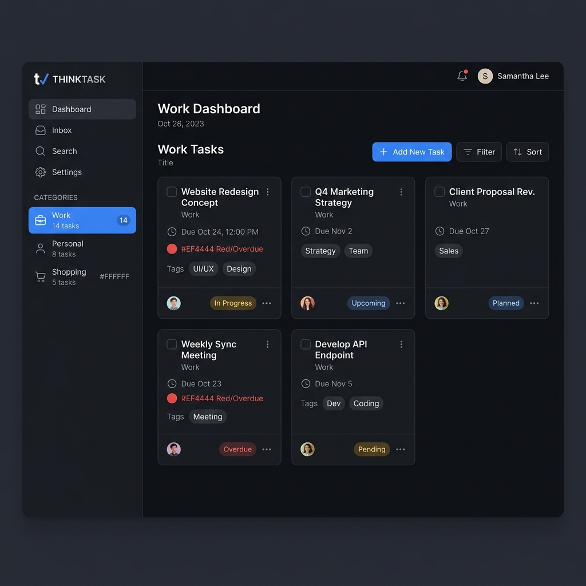

<h1 align="center">📝 MERN Stack Note Taking App ✨</h1>



Highlights:

- 🧱 Full-Stack App Built with the MERN Stack (MongoDB, Express, React, Node)
- ✨ Create, Update, and Delete Notes with Title & Description
- 🛠️ Build and Test a Fully Functional REST API
- ⚙️ Rate Limiting with Upstash Redis — a Real-World Concept
- 🚀 Completely Responsive UI
- 🌐 Explore HTTP Methods, Status Codes & SQL vs NoSQL


---

## 🧪 .env Setup

### Backend (`/backend`)

```
MONGO_URI=<your_mongo_uri>

UPSTASH_REDIS_REST_URL=<your_redis_rest_url>
UPSTASH_REDIS_REST_TOKEN=<your_redis_rest_token>

NODE_ENV=development
```

## 🔧 Run the Backend

```
cd backend
npm install
npm run dev
```

## 💻 Run the Frontend

```
cd frontend
npm install
npm run dev

```
